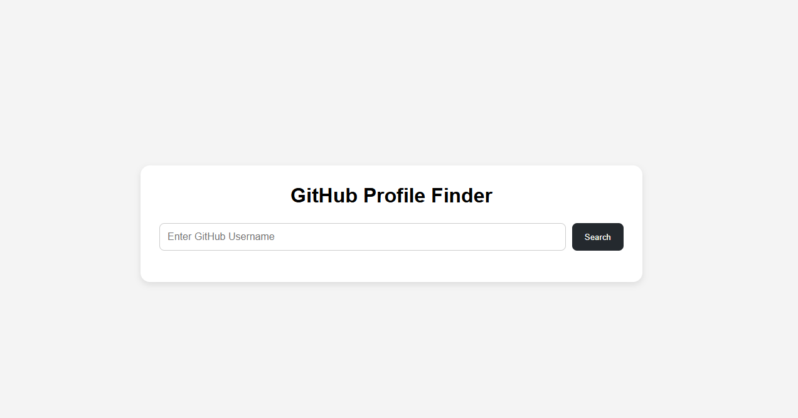
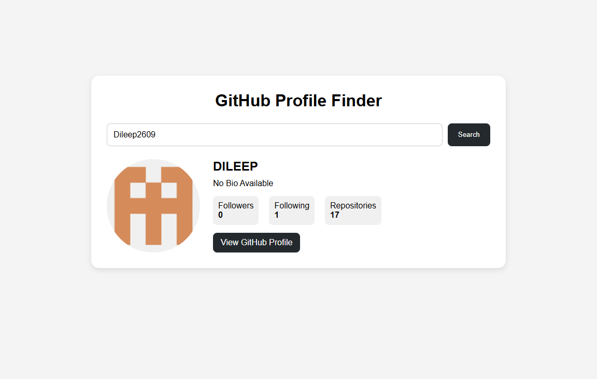
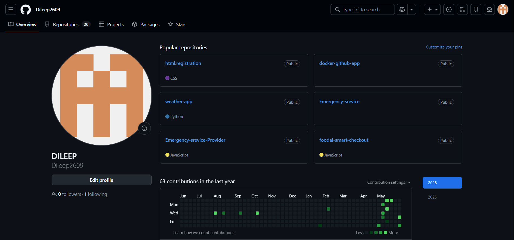

# 🔍 GitHub Finder Application

A responsive web application developed as part of the **Synent Technologies Web Development Internship Program** that allows users to search GitHub profiles using the GitHub Public API.

The application fetches and displays GitHub user information dynamically, providing a simple and user-friendly interface for exploring GitHub profiles.

---

# 🚀 Features

## 🔎 User Search

- Search GitHub users by username
- Real-time profile fetching
- Dynamic content rendering

## 👤 User Profile Information

Displays:

- Profile Picture
- Name
- Username
- Bio
- Followers Count
- Following Count
- Public Repositories
- Location
- GitHub Profile Link

## ⚡ API Integration

- GitHub REST API
- Fetch API
- JSON Data Handling

## 🚨 Error Handling

- Invalid username detection
- User not found message
- API request error handling

## ⏳ Loading State

- Loading indicator while fetching data
- Better user experience

## 📱 Responsive Design

- Desktop
- Laptop
- Tablet
- Mobile Devices

---

# 🛠️ Technologies Used

- HTML5
- CSS3
- JavaScript
- GitHub REST API
- Fetch API

---

# 📂 Project Structure

```text
synent-task6-githubfinder-dileep
│
├── index.html
├── style.css
├── script.js
├── screenshots
│   ├── homepage.png
│   ├── search-result.png
│   ├── profile-details.png
│   └── mobile-view.png
│
└── README.md
```

---

# 📸 Screenshots

## Home Page



## Search Result



## User Profile Details



## Mobile Responsive View


---

# 🔗 API Used

GitHub Public API

```text
https://api.github.com/users/{username}
```

Example:

```text
https://api.github.com/users/octocat
```

---

# 🎯 Internship Task Details

### Task Number

Task 6 – API Integration Project

### Objective

Build a web application that fetches and displays data from a public API.

### Requirements Implemented

✅ GitHub API Integration

✅ Dynamic Data Display

✅ Error Handling

✅ Loading State

✅ Responsive UI

---

# 🎥 Demo Video

### Project Demonstration

🔗 YouTube Video Link:

```text
Add Your YouTube Video Link Here
```

---

# 🌍 Live Demo

### GitHub Finder Application

🔗 Live Website Link:

```text
Add Your GitHub Pages Link Here
```

Example:

```text
https://dileep2609.github.io/synent-task6-githubfinder-dileep/
```

---

# 📝 Internship Experience Blog

### Synent Technologies Internship Experience

🔗 Blog Link:

```text
Add Your LinkedIn Blog Link Here
```

---

# 👨‍💻 Author

## Dileep Guguloth

📧 Email:
[dileepguguloth26@gmail.com](mailto:dileepguguloth26@gmail.com)

🔗 GitHub:
https://github.com/Dileep2609

🔗 LinkedIn:
https://www.linkedin.com/in/dileep-guguloth-b04416300

---

# 🏢 Internship

**Synent Technologies – Web Development Internship Program**

---

# ⭐ Learning Outcomes

Through this project, I learned:

- API Integration using Fetch API
- Working with JSON Data
- Asynchronous JavaScript
- Error Handling
- Dynamic DOM Manipulation
- Responsive Web Design

---

# ⭐ Acknowledgement

I would like to thank **Synent Technologies** for providing this internship opportunity and helping me gain practical experience in API integration and frontend web development.

---

## 📌 Repository Name

```text
synent-task6-githubfinder-dileep
```
